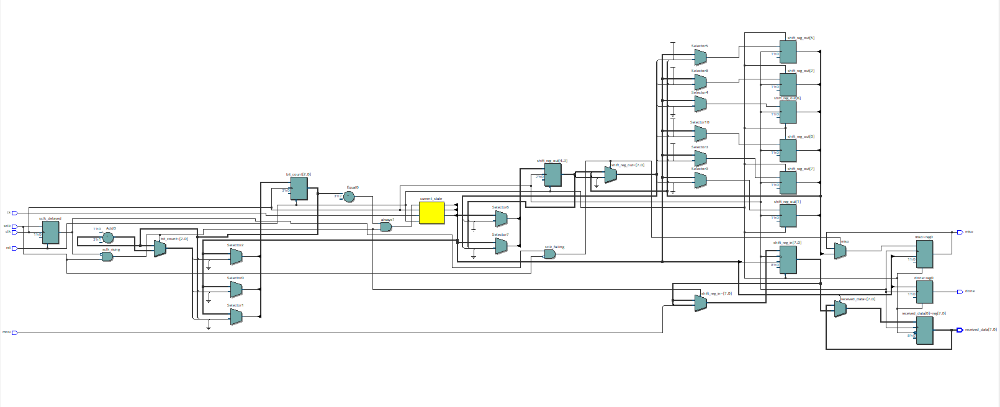
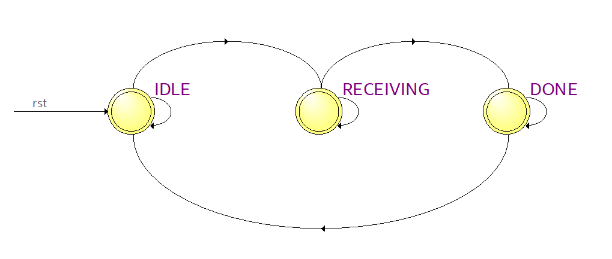
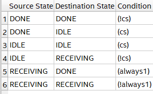
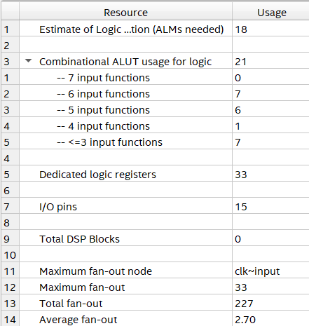
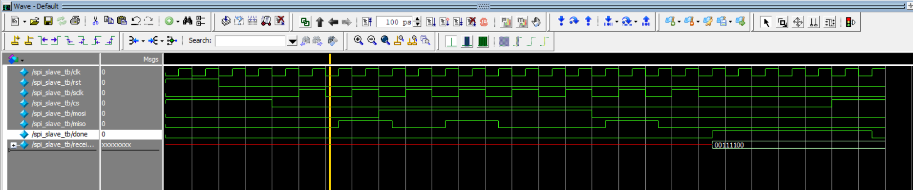

# SPI Slave - SystemVerilog

This repository contains a simple SPI slave implementation in SystemVerilog that supports **single-byte (8-bit)** SPI communication. It is designed to work with SPI Mode 0 (CPOL = 0, CPHA = 0), and can be simulated using ModelSim and synthesized in Quartus.

## 🔧 Files

- `spi_slave.sv` — Main RTL module
- `spi_slave_tb.sv` — Testbench (ModelSim compatible)
- `spi_slave_wave.do` — Optional waveform script for ModelSim

## 🔌 SPI Interface

| Signal | Direction | Description                  |
|--------|-----------|------------------------------|
| `clk`  | Input     | System clock                 |
| `rst`  | Input     | Reset                        |
| `cs`   | Input     | Chip select                  |
| `sclk` | Input     | SPI clock from master        |
| `mosi` | Input     | Master Out, Slave In         |
| `miso` | Output    | Master In, Slave Out         |
| `done` | Output    | High when 8 bits are received|
| `received_data` | Output | Received byte on MOSI |

## 🧪 Simulation

To simulate using ModelSim:
```tcl
vsim work.spi_slave_tb
do spi_slave_wave.do

```

The simulation:
  Sends a single byte 0x3C from the master.
  Observes received_data = 0x3C on the slave.
  Monitors signal transitions on sclk, mosi, miso.

## RTL view


## FSM



## Resource usage summary


## Waveform



